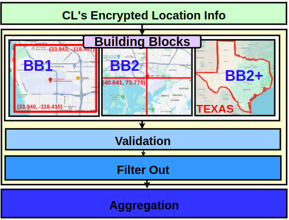

# VeLoPIR: Versatile and Fast Location-Based Private Information Retrieval with Homomorphic Encryption


<p align="center">
  
</p>

VeLoPIR is a location-based private information retrieval (PIR) system built on the TFHE library, optimized for secure location-specific data retrieval in emergency and information alert scenarios.

## Installation Guide

### Prerequisites

Before installing VeLoPIR and TFHE, ensure your system meets the following requirements:

- **C++ Compiler:** A compiler supporting C++11 standards, such as g++ (version 5.2 or higher) or clang (version 3.8 or higher). This is necessary for compiling both the core TFHE library and VeLoPIR.
  
- **OpenMP:** VeLoPIR uses OpenMP for parallel computation. Ensure your C++ compiler supports OpenMP. Most modern compilers like g++ and clang include OpenMP support. To install OpenMP on Debian-based systems, use the following command:
```markdown  
 sudo apt-get install libomp-dev
```
### TFHE Installation

1. **Install Compilers:**
```markdown  
sudo apt-get update  
sudo apt-get install g++ clang
```
2. **Clone TFHE:**
```markdown  
git clone https://github.com/tfhe/tfhe.git
```
3. **Build TFHE:**
- Navigate to the TFHE directory and build:
```markdown  
cd tfhe  
mkdir build && cd build  
cmake ../src  
make  
sudo make install
```
4. **Set Environment Variables:**
- Add the following to your `~/.bashrc` (adjust `TFHE_PREFIX` if necessary):
```markdown
export C_INCLUDE_PATH=$C_INCLUDE_PATH:/usr/local/include  
export CPLUS_INCLUDE_PATH=$CPLUS_INCLUDE_PATH:/usr/local/include  
export LIBRARY_PATH=$LIBRARY_PATH:/usr/local/lib  
export LD_LIBRARY_PATH=$LD_LIBRARY_PATH:/usr/local/lib
```
- Reload `~/.bashrc`:
```markdown
source ~/.bashrc
```
### VeLoPIR Installation

1. **Clone VeLoPIR:**

```markdown
git clone https://github.com/VeLoPIR/VeLoPIR.git
```

2. **Build VeLoPIR:**
- Navigate to the VeLoPIR directory and build:
```markdown
cd VeLoPIR  
mkdir build && cd build  
cmake ..  
make
```
### Running Tests
- Navigate to the test directory under `build/test` and execute the desired test binary. Example for `testBB1opt`:
```markdown
cd build/test/correctness/partial  
./testBB1opt
```
### Available Tests

#### Example
- convertTextBin
- decodeData
- encDecDB
- encodeData
- loadData
- testEnc

#### Correctness
- Basic Operations:
  - testBB1
  - testBB1opt
  - testBB2
  - testBB3
  - testCompGPU
  - testSup
  - testSupOPT
- Location Validation:
  - testLocOptBB1
  - testLocOptBB2
  - testLocOptBB3
  - testLocVanBB1
  - testLocVanBB2
  - testLocVanBB3

#### Time Performance
- Application:
  - timeCovidKorBB1
  - timeCovidKorBB3
  - timeCovidUSBB1
  - timeCovidUSBB3
  - timeGlobalDisBB2
  - timeWeatherUSBB3
- Parallel Optimizations:
  - timeBB1OPT
  - timeBB2OPT
  - timeBitwiseAND
  - timeCompLEOPT
  - timeCompLOPT
  - timeEquiOPT
  - timeSum
